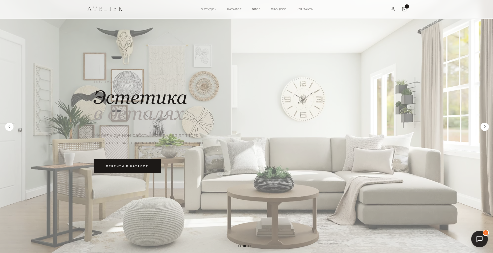
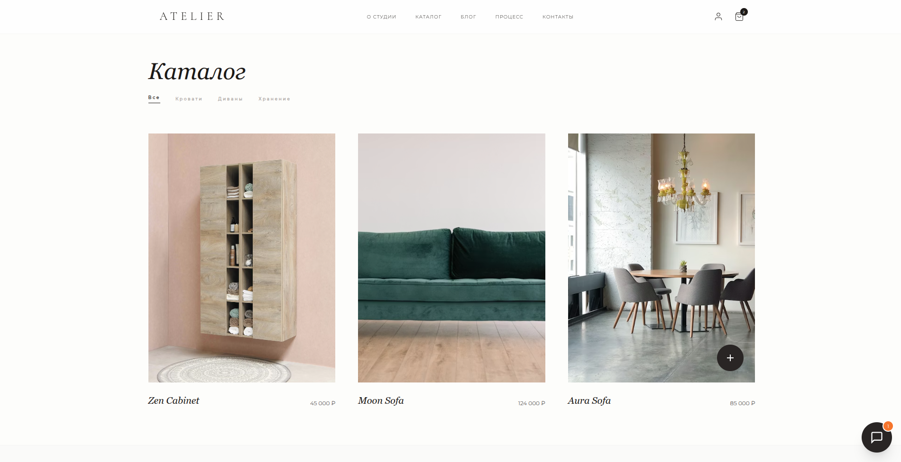
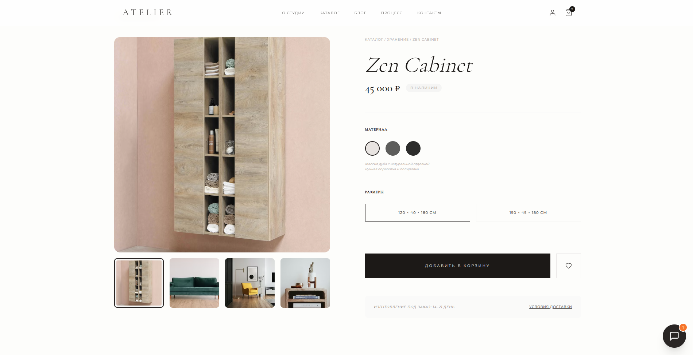
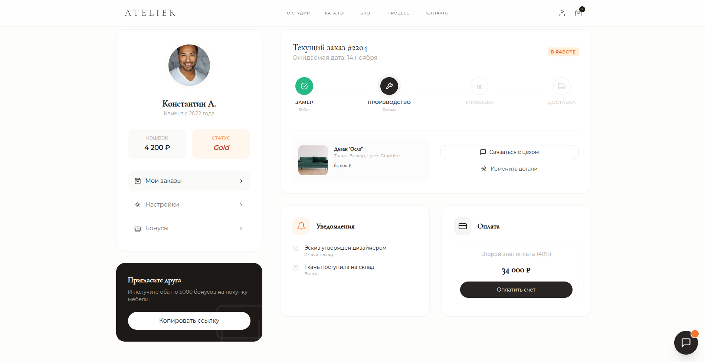

# AVESIMYERA — High-End Furniture Atelier

Vite + Tailwind playground for a luxury furniture catalog and showcase.

## Deployment

Production version: https://atelier-plum.vercel.app/

## Screenshots

Homepage:



Catalog:



Product Page:



Profile:



## Features

- **Homepage** - Hero section with brand introduction, collection showcases, and process visualization
- **Catalog** - Product grid with filtering options (All, Beds, Sofas, Storage)
- **Product Page** - Detailed product view with image gallery, material selection, and configuration options
- **Shopping Cart** - Side panel cart with smooth slide-in animation
- **Checkout** - Order form with delivery options and payment summary
- **User Profile** - Account page with active orders tracking and progress visualization
- **Orders** - Order history with status tracking and timeline visualization
- **Settings** - User preferences, personal data, and notification settings
- **Blog** - Articles about materials, trends, and production processes

## Tech Stack

- **Vite** - Build tool and dev server
- **Tailwind CSS** - Utility-first CSS framework
- **Vanilla JavaScript** - No framework, pure JS for interactivity
- **LocalStorage** - Cart persistence between pages

## Development

```bash
# Install dependencies
npm install

# Start dev server
npm run dev

# Build for production
npm run build

# Preview production build
npm run preview
```

## Customization

- **Font**: Cormorant Garamond (serif) for headings, Montserrat (sans-serif) for body text
- **Color scheme**: Stone/neutral palette with amber accents
- **Animations**: Custom slide-up, fade-in, and loading animations
- **Design**: Minimalist luxury aesthetic with focus on typography and spacing

## Pages

- `/` - Homepage with hero sections and catalog preview
- `/catalog.html` - Full product catalog with filtering
- `/first-product.html` - Individual product page
- `/checkout.html` - Checkout and order form
- `/profile.html` - User profile and active orders
- `/orders.html` - Order history and tracking
- `/settings.html` - User settings and preferences
- `/blog.html` - Blog listing page
- `/blog-post.html` - Individual blog post

## Notes

- All arbitrary Tailwind values have been extracted into separate CSS files for better maintainability
- Custom CSS classes are organized by page in the `src/` directory
- The project uses a modular approach with page-specific stylesheets

